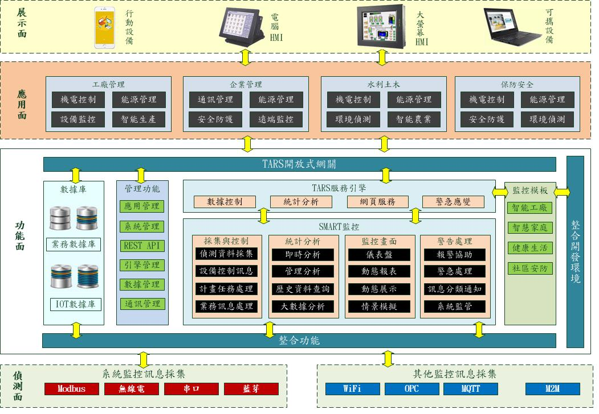
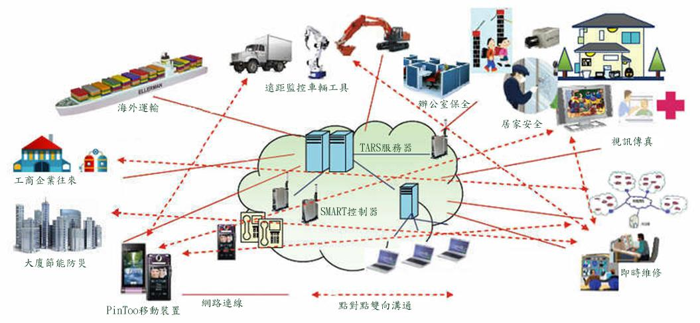

# TARS
TARS是商務軟體應用伺服器，主要功能包括：資料庫存取、物聯網監控、檔案傳輸、訊息傳輸、RestAPI、輕型Web服務，並支援多種資料庫(MSSQL、MySQL、Oracle..)的跨平臺連線服務。TARS簡單、高效、穩定、安全，提供全天候、長時間穩定的執行。TARS是愛招飛系列產品的核心，以企業資源管理與物聯網為根基，提供豐富的工業數據獲取、分析、建模，以及企業與工廠管理應用開發的能力。社區版僅供個人且非商業使用。

> **加入 Facebook 社團**
>
> [https://www.facebook.com/groups/isoface/](https://www.facebook.com/groups/isoface/)
> 
> **點讚追蹤 Facebook 粉絲專頁**
> 
> [https://www.facebook.com/AIOT.ERP](https://www.facebook.com/AIOT.ERP)

## TARS特色

TARS整合RESTful功能至物聯網框架，在此架構下，透過手機操作介面，直接連線到裝置進行操作，亦可透過TARS連線到裝置進行操作，例如工廠、辦公室、居家或社區的物聯網伺服。透過TARS技術框架可做出具有低耦合性的物聯網架構，可減少使用者操作裝置介面的複雜性，並可減低裝置連線到伺服器的複雜度，使得物聯網架構得以快速建置及方便擴充，服務品質得到很大的提昇。

其它特色說明如下：

1. 對接物聯網工廠生產與企業經營管理系統，使資訊互聯互通。
2. 支援多個數據庫連線同步快速連線。
3. 數據傳輸支援壓縮與加密，支援快速併發迴應，安全效率兼顧。
4. 支援客戶端與服務端，服務端與資料庫的自動重連。
5. 支援多表事務更新，多表聯表查詢更新，保障數據一致。
6. 支援多種物聯網協議(ModbusTCP、ModbusRTU、OPCDA、MQTT)的數據採集。
7. 支援採集數據以指令碼方式進行計算解析，可作為簡易計算閘道器使用。
8. 支援採集數據通過SQL語句實現數據轉存，可將採集的數據以指定格式儲存至目標資料庫中。
9. 支援通過WebSocket發送數據儲存指令，實現簡易數據轉存功能。
10. MQTT服務支援使用SSL連線，保護通訊連線的數據安全。
11. 支援多種語言顯示，可顯示的語言型別包括簡體中文、繁體中文與英語。

## TARS的運用
TARS是企業資源管理與物聯網整合的雲端平臺，併爲企業與工業應用提供以下強大的功能：

1. 整合車間終端機，可進行準確排程排程與效率監督。
2. 整合審批流程，實現現場控制與經營管理。
3. 通過讀取現有管理系統的資料庫，實現原有系統功能的擴充套件。
1. 與企業整合管理平臺(FastERP)整合，發揮強大的數據分析能力。
2. 與物聯網開發應用Smart整合，擴充套件物聯網裝置的功能。
3. 與移動開發應用PinToo整合，實現移動現場辦公。
4. 與網頁開發平臺FastWeb整合，實現數據跨平臺展示。
5. 作為數據採集終端，實現物聯網裝置的數據批次採集、邊緣計算與數據儲存。
6. 可作為私有、公共MQTT伺服器使用。

* **TARS 簡介**：https://isoface.net/isoface/production/tool/tars
* **TARS 幫助手冊**：https://isoface.net/isoface/doc/tars/main/
* **TARS 快速上手**：https://isoface.net/isoface/study/quick-start/tool/tars
